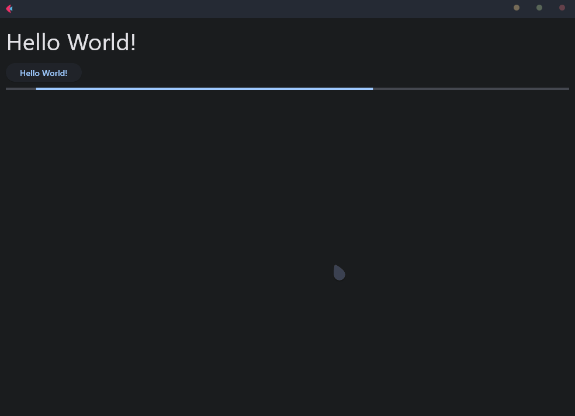
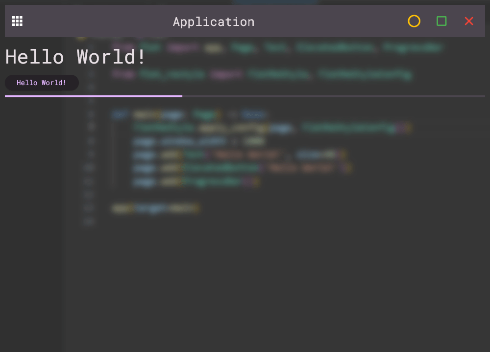

<h1 align="center">Flet ReStyle. [V1.0.0, <code>pip install flet_restyle</code></h1>
<p align="center"><i>ReStyling for Flet.</i></p>

<p align="center"><a href="https://github.com/xzripper/flet_restyle/blob/main/docs.md">Documentation.</a></p><br>

<p align="left"><b>Flet:</b></p>
<br>

<p align="right"><b>Flet ReStyle:</b></p>


<p align="center"><b>Only one line needed:</b></p>
<p align="right">

```python
FletReStyle.apply_config(page, FletReStyleConfig())
```
</p>
